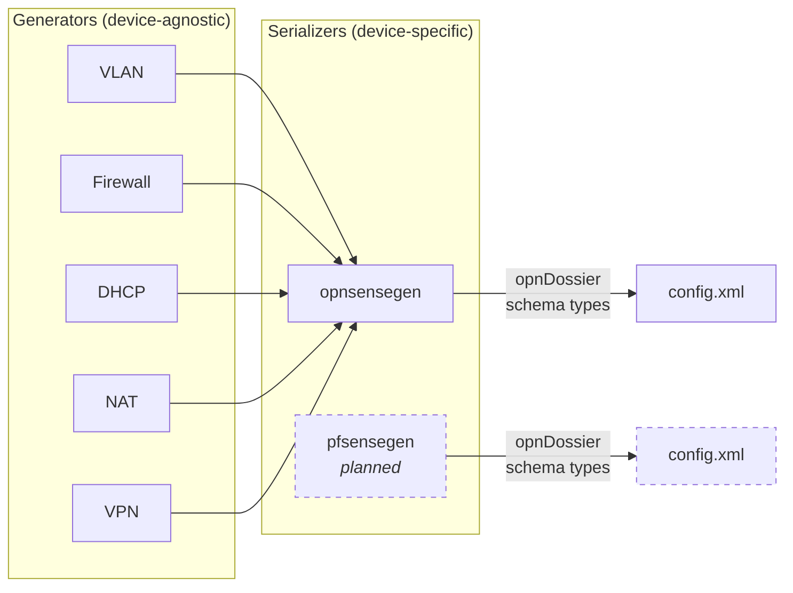

# opnConfigGenerator -- Realistic Network Device Config Generator

[![CI][ci-badge]][ci] [![Go Version][go-badge]][go] [![License][license-badge]][license] [![Go Report Card][goreportcard-badge]][goreportcard]

Generate realistic, valid OPNsense `config.xml` files populated with fake data -- for testing, training, development, and demos. No real network data exposed.

Part of the [opnDossier](https://github.com/EvilBit-Labs/opnDossier) ecosystem. Built for offline operation: single binary, no network calls, no telemetry.

## Quick Start

```bash
# Install
go install github.com/EvilBit-Labs/opnConfigGenerator@latest

# Generate 25 VLANs with firewall rules as OPNsense XML
opnconfiggenerator generate \
  --format xml \
  --count 25 \
  --base-config config.xml \
  --include-firewall-rules \
  --seed 42

# Export as CSV for spreadsheet analysis
opnconfiggenerator generate --format csv --count 50 --output vlans.csv
```

Same `--seed` always produces identical output -- across runs and platforms.

## What It Generates

| Component          | Description                                           | Options                                             |
| ------------------ | ----------------------------------------------------- | --------------------------------------------------- |
| **VLANs**          | Unique IDs, RFC 1918 networks, department assignments | 1--4085 per run                                     |
| **DHCP**           | Ranges, gateways, DNS, NTP, static reservations       | Per-VLAN automatic                                  |
| **Firewall rules** | Allow/block rules with proper dependencies            | basic (3), intermediate (7), advanced (15) per VLAN |
| **Interfaces**     | Named assignments with IP and subnet                  | Tracks opt counters                                 |
| **VPN**            | OpenVPN, WireGuard, IPsec tunnel configs              | Mix of types                                        |
| **NAT**            | Port forwards, source/dest NAT, outbound rules        | 5 rule types                                        |

All generated data passes structural validation: unique VLAN IDs, no overlapping subnets, valid RFC 1918 addresses, consistent cross-references.

## Installation

### Pre-built binaries

Download from [GitHub Releases](https://github.com/EvilBit-Labs/opnConfigGenerator/releases) for Linux, macOS (universal), and Windows.

### From source

Requires Go 1.26+:

```bash
go install github.com/EvilBit-Labs/opnConfigGenerator@latest
```

### Verify

```bash
opnconfiggenerator --version
```

## Usage

### Generate OPNsense XML

Start with a base `config.xml` (a minimal OPNsense config or an export from a real device):

```bash
opnconfiggenerator generate \
  --format xml \
  --count 10 \
  --base-config config.xml \
  --output generated.xml
```

The tool injects generated VLANs, interfaces, DHCP pools, and optionally firewall rules into the base config while preserving its existing structure.

### Generate with firewall rules

Three complexity levels control how many rules are created per VLAN:

```bash
# Basic: 3 rules per VLAN (allow internal, DNS, HTTP/S)
opnconfiggenerator generate --format xml --count 10 \
  --base-config config.xml --include-firewall-rules

# Advanced: 15 rules per VLAN (department-specific + security rules)
opnconfiggenerator generate --format xml --count 10 \
  --base-config config.xml \
  --include-firewall-rules --firewall-rule-complexity advanced
```

### Reproducible output

Use `--seed` for deterministic generation -- the same seed always produces identical configs:

```bash
# These two runs produce byte-identical output
opnconfiggenerator generate --format csv --count 20 --seed 42 --output run1.csv
opnconfiggenerator generate --format csv --count 20 --seed 42 --output run2.csv
diff run1.csv run2.csv  # no differences
```

### Export as CSV

CSV output uses German headers (`VLAN`, `IP Range`, `Beschreibung`, `WAN`) for backward compatibility with the original toolchain, and includes a UTF-8 BOM for Excel compatibility on Windows:

```bash
opnconfiggenerator generate --format csv --count 50 --output network-data.csv
```

### WAN distribution

Control how VLANs are distributed across WAN interfaces:

```bash
# All VLANs on WAN 1 (default)
opnconfiggenerator generate --format xml --count 10 --base-config config.xml

# Round-robin across WANs 1-3
opnconfiggenerator generate --format xml --count 10 --base-config config.xml \
  --wan-assignments multi

# Random distribution across WANs 1-3
opnconfiggenerator generate --format xml --count 10 --base-config config.xml \
  --wan-assignments balanced
```

## Command Reference

### `generate`

| Flag                         | Default      | Description                                                       |
| ---------------------------- | ------------ | ----------------------------------------------------------------- |
| `--format`                   | *(required)* | Output format: `csv` or `xml`                                     |
| `--count`                    | `10`         | Number of VLANs to generate (1--4085)                             |
| `--base-config`              |              | Base OPNsense XML template (required for `xml`)                   |
| `--seed`                     | `0` (random) | RNG seed for reproducible output                                  |
| `--include-firewall-rules`   | `false`      | Generate firewall rules per VLAN                                  |
| `--firewall-rule-complexity` | `basic`      | `basic` (3), `intermediate` (7), `advanced` (15) rules per VLAN   |
| `--wan-assignments`          | `single`     | WAN strategy: `single`, `multi`, `balanced`                       |
| `--output`                   | stdout       | Output file path                                                  |
| `--force`                    | `false`      | Overwrite existing output files                                   |
| `--quiet`                    | `false`      | Suppress non-error output                                         |
| `--no-color`                 | `false`      | Disable colored output (also respects `NO_COLOR` and `TERM=dumb`) |

### `validate`

Validates generated configuration files. *(Not yet implemented.)*

### `completion`

Generate shell completions:

```bash
opnconfiggenerator completion bash > /etc/bash_completion.d/opnconfiggenerator
opnconfiggenerator completion zsh > "${fpath[1]}/_opnconfiggenerator"
opnconfiggenerator completion fish > ~/.config/fish/completions/opnconfiggenerator.fish
```

## Use Cases

- **Testing opnDossier** -- Generate diverse configs to test parsing, validation, and audit features
- **Training environments** -- Create realistic lab configs for network engineering courses
- **CI/CD test fixtures** -- Deterministic `--seed` output for integration test suites
- **Demo data** -- Populate OPNsense instances for product demos without exposing real networks
- **Security research** -- Generate configs with known firewall rule patterns for analysis

## How It Works



Generators produce device-agnostic data. Device-specific serializers translate that into the target schema using [opnDossier's canonical types](https://github.com/EvilBit-Labs/opnDossier). Generated configs are structurally identical to real device exports.

Currently supports OPNsense. pfSense support is planned as opnDossier expands its device parser coverage.

## Development

```bash
git clone https://github.com/EvilBit-Labs/opnConfigGenerator.git
cd opnConfigGenerator
just install   # Install dependencies via mise
just test      # Run tests
just ci-check  # Full CI validation (required before committing)
just build     # Build binary
```

See [CONTRIBUTING.md](CONTRIBUTING.md) for coding standards, architecture details, and PR process.

## Related Projects

- **[opnDossier](https://github.com/EvilBit-Labs/opnDossier)** -- Process OPNsense/pfSense configs into documentation, audits, and structured data

## License

[Apache-2.0](LICENSE)

<!-- Badge links -->

[ci]: https://github.com/EvilBit-Labs/opnConfigGenerator/actions/workflows/ci.yml
[ci-badge]: https://github.com/EvilBit-Labs/opnConfigGenerator/actions/workflows/ci.yml/badge.svg
[go]: https://go.dev
[go-badge]: https://img.shields.io/github/go-mod/go-version/EvilBit-Labs/opnConfigGenerator
[goreportcard]: https://goreportcard.com/report/github.com/EvilBit-Labs/opnConfigGenerator
[goreportcard-badge]: https://goreportcard.com/badge/github.com/EvilBit-Labs/opnConfigGenerator
[license]: https://github.com/EvilBit-Labs/opnConfigGenerator/blob/main/LICENSE
[license-badge]: https://img.shields.io/github/license/EvilBit-Labs/opnConfigGenerator
