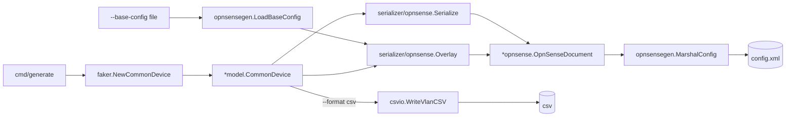

# opnConfigGenerator -- CommonDevice → config.xml reverse serializer

[![CI][ci-badge]][ci] [![Go Version][go-badge]][go] [![License][license-badge]][license] [![Go Report Card][goreportcard-badge]][goreportcard]

Generate realistic, valid OPNsense `config.xml` files from a synthetic [opnDossier](https://github.com/EvilBit-Labs/opnDossier) `CommonDevice`. opnDossier parses `config.xml → CommonDevice`; opnConfigGenerator is the missing inverse: `faker → CommonDevice → OpnSenseDocument → config.xml`. No inputs required — the tool owns every field.

Built for offline operation: single binary, no network calls, no telemetry.

## Quick Start

```bash
# Install
go install github.com/EvilBit-Labs/opnConfigGenerator@latest

# Zero arguments -- a valid config.xml on stdout
opnconfiggenerator generate

# Reproducible output (same seed => byte-identical bytes)
opnconfiggenerator generate --seed 42 > config.xml

# 20 VLANs with default firewall rules
opnconfiggenerator generate --vlan-count 20 --firewall-rules --seed 42

# Overlay generated content onto an existing config, preserving everything
# outside the serializer's Phase 1 scope (NAT, VPN, certificates, ...)
opnconfiggenerator generate --base-config existing.xml --seed 42

# CSV inspection dump of the generated VLANs
opnconfiggenerator generate --format csv --vlan-count 10 --seed 42
```

Same `--seed` always produces byte-identical output across runs and platforms.

## Pipeline



`*model.CommonDevice` is the single intermediate representation. opnDossier defines it; this project populates and serializes it. A future `internal/serializer/pfsense/` sibling will plug in alongside `internal/serializer/opnsense/` when pfSense support lands; the CLI routes by `CommonDevice.DeviceType`.

## What the Phase 1 Serializer Covers

| Subsystem      | Coverage                                                         |
| -------------- | ---------------------------------------------------------------- |
| System         | Hostname, domain, timezone, DNS/NTP servers, WebGUI/SSH defaults |
| Interfaces     | WAN (DHCP), LAN (static RFC 1918 /24), per-VLAN opt interfaces   |
| VLANs          | Unique 802.1Q tags [2..4094] on shared physical parent           |
| DHCP           | ISC DHCP scope per statically-addressed interface (WAN excluded) |
| Firewall rules | One default pass rule per non-WAN interface (opt-in)             |

Deferred to follow-up plans (one per subsystem): NAT, VPN (OpenVPN/WireGuard/IPsec), Users/Groups, Certificates/CAs, IDS, HighAvailability, VirtualIPs, Bridges, GIF/GRE/LAGG, PPP, CaptivePortal, Kea DHCP, Monit, Netflow, TrafficShaper, Syslog forwarding, pfSense target.

## Command Reference

### `generate`

| Flag                | Default      | Description                                                       |
| ------------------- | ------------ | ----------------------------------------------------------------- |
| `--format`          | `xml`        | Output format: `xml` (valid config.xml) or `csv` (VLAN dump)      |
| `--vlan-count`/`-n` | `10`         | Number of VLANs to generate (0--4092)                             |
| `--base-config`     |              | Optional base `config.xml`; serializer overlays onto it           |
| `--firewall-rules`  | `false`      | Include default allow-all-to-any rules per interface              |
| `--seed`            | `0` (random) | RNG seed for reproducible output                                  |
| `--hostname`        |              | Override the generated hostname                                   |
| `--domain`          |              | Override the generated domain                                     |
| `--output`/`-o`     | stdout       | Output file path                                                  |
| `--force`           | `false`      | Overwrite existing output files                                   |
| `--quiet`           | `false`      | Suppress non-error output                                         |
| `--no-color`        | `false`      | Disable colored output (also respects `NO_COLOR` and `TERM=dumb`) |

### `validate`

Validates generated configuration files. *(Not yet implemented.)*

### `completion`

Generate shell completions:

```bash
opnconfiggenerator completion bash > /etc/bash_completion.d/opnconfiggenerator
opnconfiggenerator completion zsh > "${fpath[1]}/_opnconfiggenerator"
opnconfiggenerator completion fish > ~/.config/fish/completions/opnconfiggenerator.fish
```

## Use Cases

- **Testing opnDossier** -- Round-trip synthetic configs through the parser to catch schema or conversion regressions
- **Training environments** -- Realistic lab configs for network engineering courses without real network exposure
- **CI/CD test fixtures** -- Deterministic `--seed` output for integration test suites
- **Demo data** -- Populate OPNsense instances for product demos without exposing real networks
- **Security research** -- Generate configs with controlled firewall rule shapes for analysis

## Installation

### Pre-built binaries

Download from [GitHub Releases](https://github.com/EvilBit-Labs/opnConfigGenerator/releases) for Linux, macOS (universal), and Windows.

### From source

Requires Go 1.26+:

```bash
go install github.com/EvilBit-Labs/opnConfigGenerator@latest
```

Verify:

```bash
opnconfiggenerator --version
```

## Development

```bash
git clone https://github.com/EvilBit-Labs/opnConfigGenerator.git
cd opnConfigGenerator
just install   # Install dependencies via mise
just test      # Run tests
just ci-check  # Full CI validation (required before committing)
just build     # Build binary
```

See [CONTRIBUTING.md](CONTRIBUTING.md) for coding standards and PR process.

## Related Projects

- **[opnDossier](https://github.com/EvilBit-Labs/opnDossier)** -- Process OPNsense/pfSense configs into documentation, audits, and structured data. opnDossier provides `*model.CommonDevice` and `*opnsense.OpnSenseDocument` as public API; this project is its reverse serializer.

## License

[Apache-2.0](LICENSE)

<!-- Badge links -->

[ci]: https://github.com/EvilBit-Labs/opnConfigGenerator/actions/workflows/ci.yml
[ci-badge]: https://github.com/EvilBit-Labs/opnConfigGenerator/actions/workflows/ci.yml/badge.svg
[go]: https://go.dev
[go-badge]: https://img.shields.io/github/go-mod/go-version/EvilBit-Labs/opnConfigGenerator
[goreportcard]: https://goreportcard.com/report/github.com/EvilBit-Labs/opnConfigGenerator
[goreportcard-badge]: https://goreportcard.com/badge/github.com/EvilBit-Labs/opnConfigGenerator
[license]: https://github.com/EvilBit-Labs/opnConfigGenerator/blob/main/LICENSE
[license-badge]: https://img.shields.io/github/license/EvilBit-Labs/opnConfigGenerator
